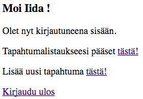
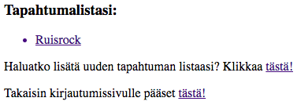
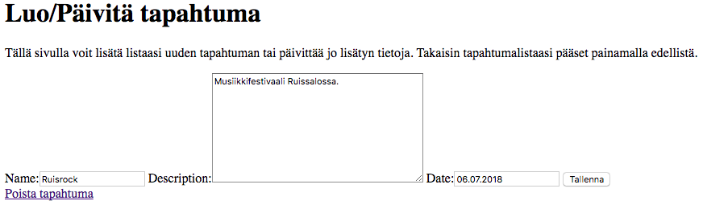
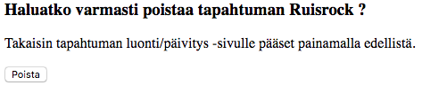

# Harjoitustyön toinen vaihe

Harjoitustyön ensimmäisessä vaiheessa toteutin sovellukseeni jo kirjautumis- ja rekisteröitymispalvelun. Sovellukseni pääideana on, että käyttäjä voisi tutkimalla dataa erilaisista tapahtumarajapinnoista luoda itselleen jonkinlaisen check-listin kiinnostavista tapahtumavaihtoehdoista. Tähän palautukseen loin kuitenkin vasta "raakaversion" CRUD-toiminnoista ja jätin datan esittelytoteutuksen myöhemmille palautuksille. Tämänhetkisessä toteutuksessa käyttäjä voi siis sisäänkirjauduttuaan linkkiä klikkaamalla siirtyä sivulle, jossa voi lisätä listaansa uuden tapahtuman sisältäen tapahtuman nimen, kuvauksen sekä päivämäärän. Listaan jo valmiiksi lisättyjä tapahtumia pääsee muokkaamaan (tai poistamaan listasta) edelleen niitä klikkaamalla. Toiminnot sain luotua pitkälti seuraamalla [tätä](https://www.youtube.com/watch?v=Kf9KB_TZY5U) tutoriaalia.

#### Mallin luonti applikaatioon
Jotta voitaisiin lähteä luomaan "luo, lue, päivitä, poista"-toimintoja, täytyy applikaatiolle luoda malli tapahtuman rakenteesta. Kaikki vastauskentät määrittelin tekstikentiksi. Tavoitteena olisi, että esimerkiksi tapahtumapäivämäärän saisi klikattua suoraan jonkinmoiseen kalenteriin, mutta vielä tässä vaiheessa toteutus on hyvin yksinkertainen tekstikenttään kirjoitettava päivämäärä. Jotta saataisiin tallennettua muutokset tietokantaan, mallin rakentamisen jälkeen on syytä muistaa näpytellä päätteeseen seuraavat komennot:
```
$ python3 manage.py migrate
```
```
$ python3 manage.py makemigrations
```
Mallin loin applikaation `models.py` -tiedostoon, johon tein seuraavanlaisia muutoksia:
```
class Tapahtuma(models.Model):
    name = models.CharField(max_length=200)
    description = models.TextField()
    date = models.CharField(max_length=30)

    def __str__(self):
        return self.name
```
#### Itse toimintojen toteuttaminen
Jo aiemmassa palautuksessa projektin `urls.py`-tiedostossa kohdassa `urlpatterns` applikaatio liitettiin projektiin `include`-funktiolla ja applikaation alle luotiin oma `urls.py`tiedosto, johon tein tällä kertaa seuraavanlaisia muutoksia:
```
from .views import list_events, create_event, update_event, delete_event


urlpatterns = [
    path('etusivu', list_events, name='list_events'),
    path('new', create_event, name='create_event'),
    path('update/<int:id>/', update_event, name='update_event'),
    path('delete/<int:id>/', delete_event, name='delete_event'),
]
```
Eli `views.py`-tiedostosta tuotiin funktiot `list_events`, `create_event`, `update_event` ja `delete_event`, jotka liitettiin URL-polkuihin sopivilla nimillä. Tapahtuman päivittämiseen ja poistamiseen tarkoitettua polkua luotaessa on tärkeä käyttää id-tunnistetta, sillä kyseessä on aina jokin tietty päivitettävä/poistettava tapahtuma.

Seuraavaksi toiminnoille tuli luoda funktiot, jotka toteutin `views.py`-tiedostossa seuraavasti:

```
def list_events(request):
    tapahtuma = Tapahtuma.objects.all()
    return render(request, 'tapahtuma.html', {'tapahtuma':tapahtuma})

def create_event(request):
    form = TapahtumaForm(request.POST or None)
    if form.is_valid():
        form.save()
        return redirect('list_events')
    return render(request, 'tapahtuma-form.html', {'form':form})

def update_event(request, id):
    tapahtuma = Tapahtuma.objects.get(id=id)
    form = TapahtumaForm(request.POST or None, instance = tapahtuma)

    if form.is_valid():
        form.save()
        return redirect('list_events')
    return render(request, 'tapahtuma-form.html',
     {'form':form,'tapahtuma':tapahtuma})

def delete_event(request, id):
    tapahtuma = Tapahtuma.objects.get(id=id)

    if request.method == 'POST':
        tapahtuma.delete()
        return redirect('list_events')
    return render(request, 'tapahtuma-delete-confirm.html',
     {'tapahtuma':tapahtuma})
```
Funktioissa viitatuille  html-tiedostoille, loin oman `templates`-hakemiston applikaation alle. Ensimmäinen tiedosto, `tapahtuma.html`, näyttää käyttäjälle jo olemassa olevan tapahtumalistan ja tarjoaa linkin kautta mahdollisuuden siirtyä luomaan uuden tapahtuman tai takaisin kirjautumissivulle. Muokkaamaan jo olemassa olevaa tapahtumaa käyttäjä pääsee klikkaamalla haluttua vaihtoehtoa listasta. Tapahtuman luonti/päivitys-näkymän tein `tapahtuma-form.html`-tiedostoon. Tässä näkymässä käyttäjä voi joko muokata aiemmin lisättyä tapahtumaa tai lisätä uuden syöttämällä tietoja name-, description- ja date-laatikoihin. Sivulla saa myös poistettua tapahtuman linkin kautta, joka ohjaa käyttäjän uuteen, `tapahtuma-delete-confirm.html`-tiedostossa luotuun, näkymään. Tässä käyttäjältä kysytään vahvistusta tapahtuman poistamisesta. Seuraavaksi otteita edellä mainituista html-tiedostoista.

```
<!-- Ote tapahtuma.html-tiedostosta -->

  <body>
    <h3>Tapahtumalistasi:</h3>
    <ul>
      
        <a href="">
          <li> {{ tapahtuma.name }}</li>
        </a>
      
    </ul>

    <p>
      Haluatko lisätä uuden tapahtuman listaasi? Klikkaa
      <a href="" > tästä! </a>
    </p>
    <p>Takaisin kirjautumissivulle pääset <a href="/">tästä!</a></p>
  </body>
```
```
<!-- Ote tapahtuma-form.html-tiedostosta -->

  <body>
    <h1>Luo/Päivitä tapahtuma</h1>
    <p>
      Tällä sivulla voit lisätä listaasi uuden tapahtuman tai
      päivittää jo lisätyn tietoja. Takaisin tapahtumalistaasi
      pääset painamalla edellistä.
    </p>
    <form method="POST">
      
      {{ form }}
      <button type="submit">Tallenna</button>
    </form>

    
      <a href="" >Poista tapahtuma</a>
    
  </body>
```
```
<!-- Ote tapahtuma-delete-confirm.html-tiedostosta -->

  <body>
    <form method="post">
      
      <h3>Haluatko varmasti poistaa tapahtuman {{ tapahtuma.name }} ?</h3>
      <p>
      Takaisin tapahtuman luonti/päivitys -sivulle pääset painamalla edellistä.
      </p>
      <button type="submit">Poista</button>
    </form>
  </body>
```
#### Otteita käyttäjänäkymistä

> 
<small><strong>Kuva 1.</strong> Käyttäjän näkymä sisäänkirjautumisen jälkeen. </small>


> 
<small><strong>Kuva 2.</strong> Tällä sivulla käyttäjä voi katsoa jo listattuja tapahtumia.</small>


> 
<small><strong>Kuva 3.</strong>Tässä näkymässä käyttäjä voi luoda uuden, pääivittää vanhaa tai
poistaa tapahtuman. </small>


> 
<small><strong>Kuva 4.</strong> Näkymä sivusta, jossa käyttäjää pyydetään vahvistamaan
tapahtuman poistopäätös. </small>

#### Hyviä lähteitä
+ **Youtube-tutoriaali CRUD-toimintojen luomisesta:**   
https://www.youtube.com/watch?v=Kf9KB_TZY5U
+ **Django Girls Tutorial**:      
https://tutorial.djangogirls.org/en/
#### Ilmenneet hankaluudet ja muut huomiot
+ Puuduttavien dokumentaatioiden sijaan toimintojen toteuttamisen apuna toimi tällä kertaa YouTube-tutoriaali, jonka koin paljon tehokkaammaksi tavaksi oppia.
+ Haastavaa ja hyvin paljon harmaita hiuksia aiheuttavaa oli myös pienistä huolimattomuusvirheistä aiheutuneet Error-tilanteet ja niiden selvittäminen
+ Vaikeuksia oli edelleen hahmottaa ylipäätään sitä, mistä lähteä liikkeelle. Mitä dataa toisi palveluunsa tai millä tavoin integroisi siihen järkevästi CRUD-toiminnot? Kunhan punaisesta langasta saa kiinni, työ alkaa pikkuhiljaa sujua.
