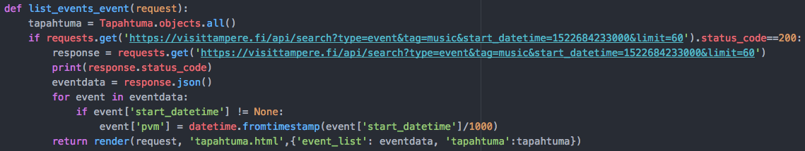
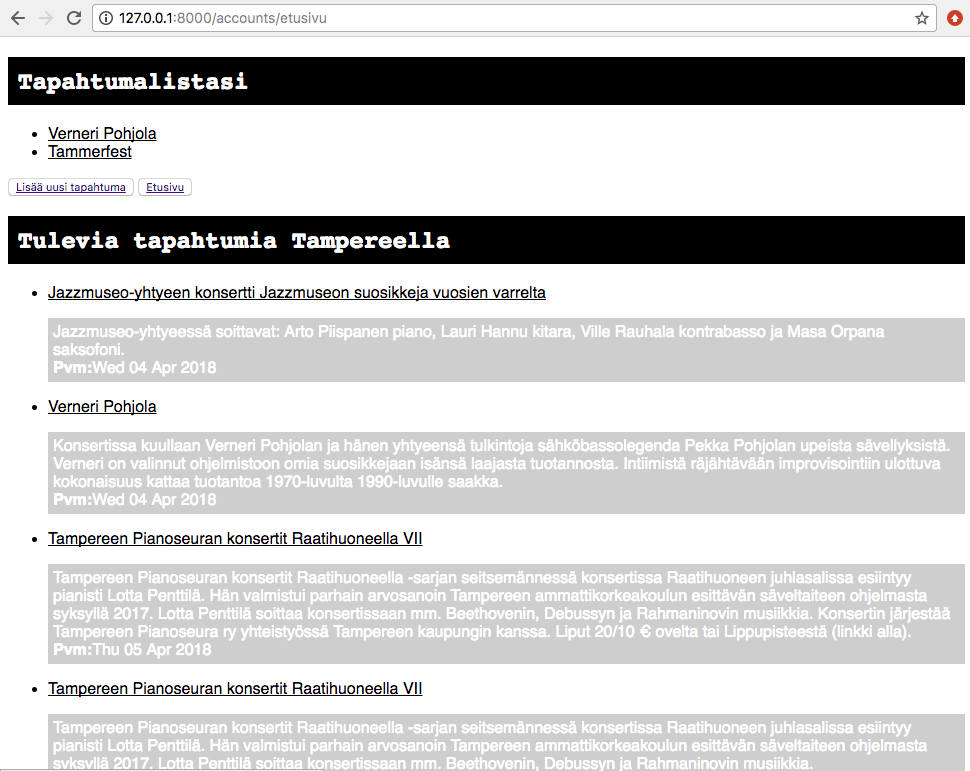

# Harjoitustyön kolmas vaihe

Tässä vaiheessa harjoitustyötä olen toteuttanut jo kirjautumis- sekä rekisteröitymispalvelun ja CRUD-toiminnot sovellukseeni. Ideana oli se, että käyttäjä voisi lisätä, muokata, tallentaa ja poistaa omaan listaansa kiinnostavia tapahtumia. Tähän ideaan nojautuen päätin esittää palvelussani [visittampere.fi](https://visittampere.fi/) -sivuston esittämää tapahtumadataa sen API:n kautta. Päätin rajata esitettävät tapahtumat vielä musiikkitapahtumiksi.

Tulevaisuudessa olisi tarkoitus parantaa palvelun toiminnallisuutta ainakin siten, että käyttäjä voisi suoraan tulevien tapahtumien listasta klikata itseä kiinnostavat tapahtumat omaan listaansa manuaalisen syötön sijaan.

#### Rajapinnan käyttö

Rajapinnan käyttöönottoa varten tuli ensin ladata komentorivin kautta Python requests seuraavasti:
```
pip3 install requests
```
Seuraavaksi `views.py`-tiedostossa importtasin juuri ladatun paketin ja toteutin datan lukemisen samaan funktioon kuin jo aiemmin luomani tapahtumalistauksen, jotta saisin määriteltyä ne saman polun alle `urls.py`-tiedostossa. Funktio näytti seuraavalta:




Jos datan luku onnistuu (eli status.code==200), sivuston data, jossa on tagina *music*, kerätään muuttujaan *eventdata*. Koko data käydään läpi none-arvoisten päivämäärien varalta. Koska tapahtumien alkamisajankohdat olivat esitetty datassa epoch-aikana, käytin pythonin metodia `datetime.fromtimestamp()` ajan kääntämiseen. Sitä varten tuli suorittaa komento `from datetime import datetime` ja koska datassa aika oli ilmaistu millisekunteina ja metodi vaati oikein toimiakseen sen sekunneiksi, jaoin koko luvun tuhannella.

#### Datan esitys

Tapahtumadatan esitys tapahtui hyvin yksinkertaisesti jo aiemmin luomassani `tapahtuma.html`-tiedostossa, josta pääkohdat ovat seuraavanlaiset:

```
<!-- Ote tapahtuma.html-tiedostosta -->


<a href="{{event.contact_info.link}}">{{ event.title }}</a>
{{event.description}}
Pvm:{{event.pvm | date:"D d M Y" }}
```
Edellä käydään läpi tapahtumarajapinnan dataa niin, että sivulla näytetään ensin tapahtuman otsikko, sitten sen kuvaus ja päivämäärä. Lisäksi tapahtuman otsikkoa klikkaamalla pääsee tapahtumajärjestäjän sivuille.

Näkymä käyttäjälle on tällä hetkellä seuraava:



#### Hyviä lähteitä
+ **How to Use RESTful APIs with Django:**<br>
https://simpleisbetterthancomplex.com/tutorial/2018/02/03/how-to-use-restful-apis-with-django.html </br>
+ **Working with JSON and Django:**<br>
https://stackoverflow.com/questions/31273695/working-with-json-and-django </br>
+ **VisitTampere API:**<br>
https://visittampere.fi/api-docs/#!/default/search_get </br>
+ **Python - 8.1 datetime: Basic date and time types:**
https://docs.python.org/3/library/datetime.html


#### Ilmenneet hankaluudet ja muut huomiot
+ Epoch-ajan kääntäminen "normaaliksi" oli jokseenkin haastavaa
+ Vaikka tehtävä tuntui aluksi vaikealta, osoittautui rajapinnan käyttö. suhteellisen yksinkertaiseksi prosessiksi ja siihen löytyi netistä paljon apua.
+ Erityisesti *visittampere.fi* -sivuston API:n käyttäminen oli helppoa dataa jo valmiiksi järjestelevän "hakupalvelun" avulla.
+ Vaikeuksia oli taas hahmottaa ylipäätään se, mitä dataa ja millä tavoin haluaa lähteä sitä esittämään ja miten se tukee aiemmin luotuja toiminnallisuuksia.
