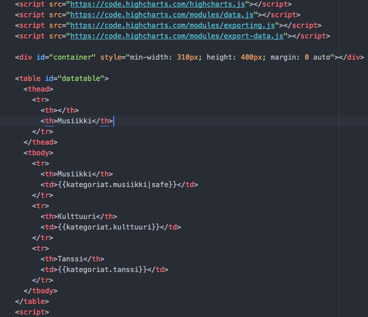
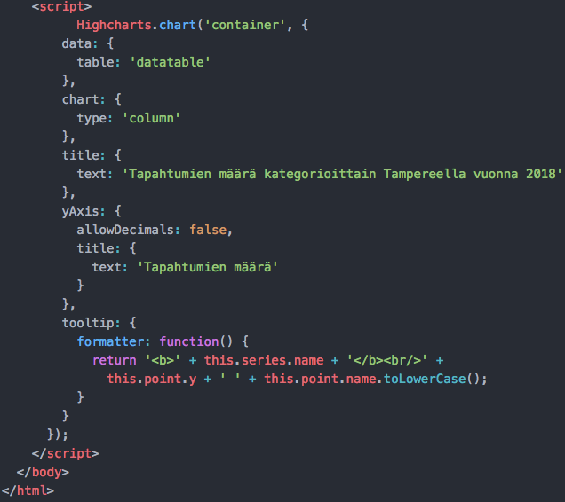
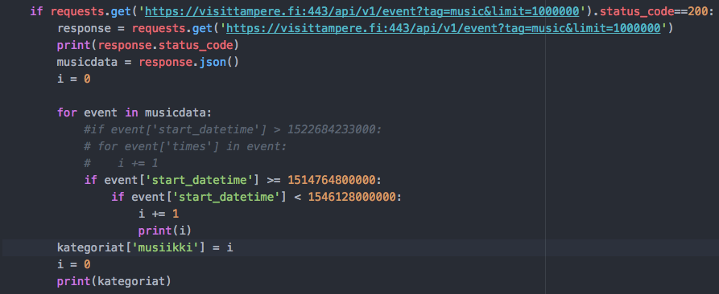
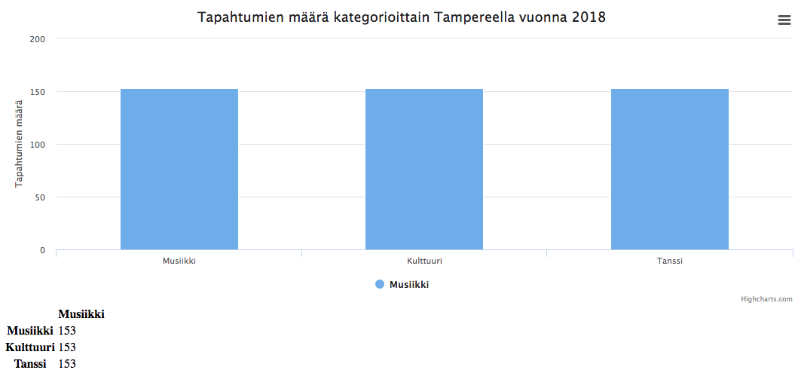

# Harjoitustyön neljäs vaihe

Tässä vaiheessa harjoitustyötä olen toteuttanut jo kirjautumis- sekä rekisteröitymispalvelun, CRUD-toiminnot ja rajapinnan käyttöönoton sovellukseeni. Harjoitustyön neljänteen vaiheeseen toteutin visualisoinnin Highchartsilla. Visualisointi e esittää vuoden 2018 dataa tapahtumien määrästä, joihin liittyy musiikki, tanssi, ja kulttuuri.

#### Teknologiat

+ Django 2.0.2
+ Python 3.6.4
+ SQLite
+ Atom

#### Näkymän luominen

Ensimmäiseksi loin haluamani Highcharts-visualisoinnin JSFiddle-palvelulla, jonka rakenteen sai helposti kopioitua omaan html-tiedostoon.

Seuraavaksi loin `views.py`-kansioon funktion, joka käy läpi rajapinnan dataa laskien sieltä tapahtumien määrää. Funktio hakee dataa jo valmiiksi kategorioihin rajatuista json-tiedostoista.

Myös `urls.py`-kansioon piti muistaa luoda polku html-sivun näkymälle. Seuraavaksi on esitetty html-sivulla luotu Highcharts-näkymä tapahtumadatalle.

Palkit yltävät yhtä korkeiksi, sillä tulevat tapahtumat sisältävät kaikki kategoriat.

#### Hyviä lähteitä
+ How to Integrate Highcharts.js with Django: https://simpleisbetterthancomplex.com/tutorial/2018/04/03/how-to-integrate-highcharts-js-with-django.html
+ JSFiddle: https://jsfiddle.net/
+ Highcharts demo: https://www.highcharts.com/demo

#### Ilmenneet hankaluudet ja muut huomiot
+ Rajapinnasta oli vaikea keksiä hyvää dataa esitettäväksi
+ Dictin käsittely html-sivulla tuotti vaikeuksia
+ Javascript tuntuu vielä aika vieraalta
